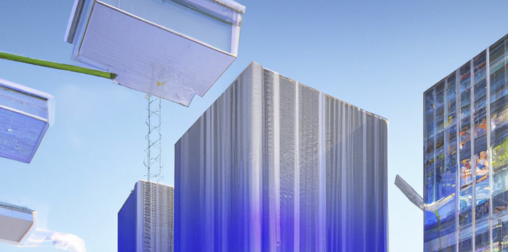

- Dare to dream
- Ignite your inspiration and innovation
- Strive for excellence
- Explore together & unlock the world's knowledge

# GloboHabitat Initiative - GenAI
In a world facing the dual challenges of rapid urbanization and environmental degradation, the GloboHabitat Initiative emerges as a beacon of innovation and sustainability by harnessing the power of GenAI.

This scenario envisions a future where technology, collaboration, and holistic thinking have converged to solve the pressing issue of affordable, sustainable housing on a global scale. The initiative is a multifaceted approach that leverages cutting-edge technology, innovative design, and international cooperation to create housing solutions that are both environmentally friendly and accessible to people of all income levels.

Core Components of the GloboHabitat Initiative:

1. Modular Eco-Structures:   - Employing the latest advancements in materials science, GloboHabitat introduces modular homes made from recycled, bio-based composites that are carbon-neutral and extremely durable. These structures are designed for easy assembly and disassembly, allowing for them to be moved or repurposed as needed, dramatically reducing waste and environmental impact.

2. 3D-Printed Neighborhoods:   - Harnessing the precision and efficiency of 3D printing technology, entire neighborhoods can be constructed within weeks instead of years, significantly reducing labor costs and making housing more affordable. These 3D-printed buildings incorporate solar cells in their structure, enabling them to generate clean energy for the community.

3. Vertical Farms and Green Spaces:   - Each GloboHabitat community integrates vertical farms and lush, green spaces into its design, ensuring access to fresh produce and promoting biodiversity. This not only contributes to residents' physical health but also supports mental well-being, creating a harmonious living environment.

4. Smart Water Management Systems:   - Innovative water collection, recycling, and purification technologies are embedded within communities, ensuring sustainable water usage and minimizing waste. Rainwater harvesting, greywater recycling, and smart irrigation systems support both household and agricultural needs efficiently.

5. AI-driven Community Management:   - Artificial Intelligence (AI) systems manage the community's energy consumption, traffic flow, and maintenance issues, optimizing resources and enhancing living conditions. These intelligent systems facilitate a responsive and adaptive community infrastructure, capable of evolving with its inhabitants' needs.

6. Decentralized Renewable Energy Grid:   - Communities are powered by a decentralized grid of renewable energy sources, including solar, wind, and biogas. This not only reduces the carbon footprint but also ensures energy security and resilience against disruptions.

7. 
